  <!-- Knock Code Pictures -->
  <picture>
    <source media="(prefers-color-scheme: dark)" srcset="https://cdn.jsdelivr.net/gh/sun0225SUN/sun0225SUN/assets/images/coding.gif" />
    <source media="(prefers-color-scheme: light)" srcset="https://cdn.jsdelivr.net/gh/sun0225SUN/sun0225SUN/assets/images/icon.png" height="225px" />
    
  </picture>

  <!-- for beauty -->
  
&nbsp;

<!-- Welcome words -->
<h1 style="color: #FFC0CB;">Welcome to Huiwen's GitHub ! 🍀</h1>

<!-- Little Logo -->

  

    
  

<!-- World Peaceful words -->

<!-- Stats Words -->

<!-- Skills Emoji -->

<!-- Stats Card -->

<!-- Award List -->

<!-- GitHub Activity Graph GitHub -->
<table>
  <tr>
    <td>
      <picture>
        <source media="(prefers-color-scheme: dark)"  srcset="https://github-readme-activity-graph.vercel.app/graph?username=Huiwen-Tan&theme=high-contrast" />
        <source media="(prefers-color-scheme: light)" srcset="https://github-readme-activity-graph.vercel.app/graph?username=Huiwen-Tan" />
        
      </picture>
  </tr>
</table>

<!-- 3D Contribution -->

<!-- Dynamic Skills Logo -->

<!---
- 👋 Hi, I’m @Huiwen-Tan
- 👀 I’m interested in ...
- 🌱 I’m currently learning ...
- 💞️ I’m looking to collaborate on ...
- 📫 How to reach me ...
- 😄 Pronouns: ...
- ⚡ Fun fact: ...
--->

<!---
Huiwen-Tan/Huiwen-Tan is a ✨ special ✨ repository because its `README.md` (this file) appears on your GitHub profile.
You can click the Preview link to take a look at your changes.
--->
